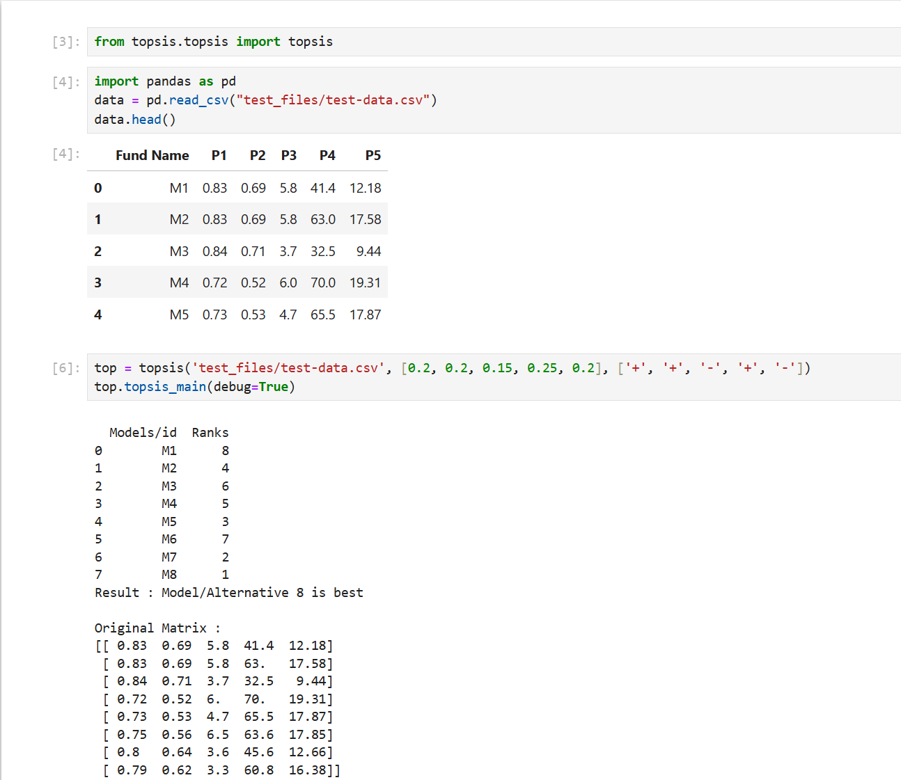
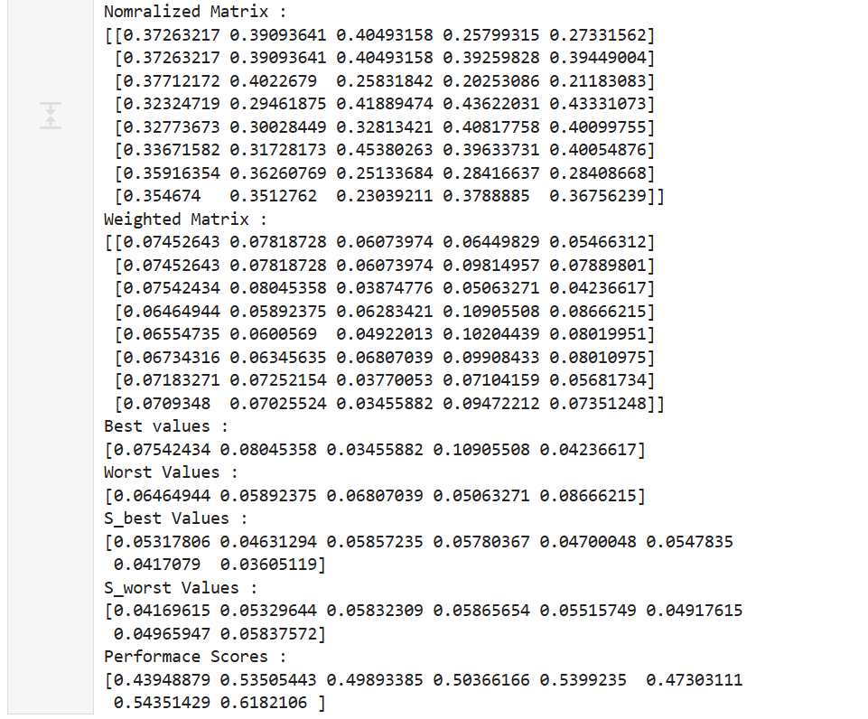
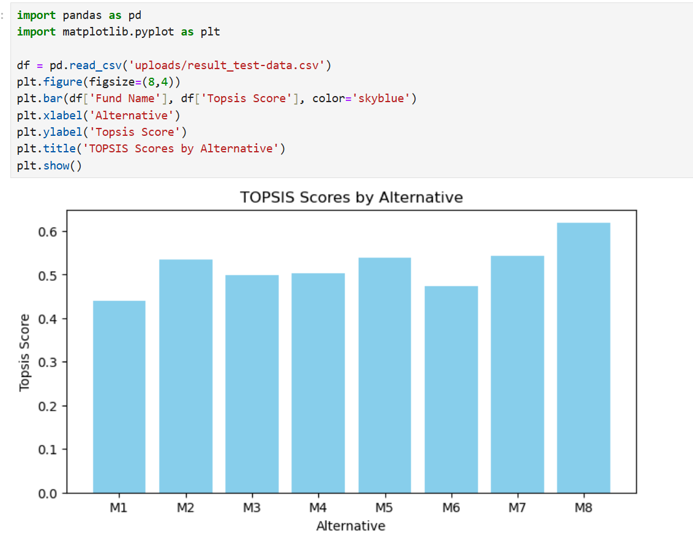

# topsis-python

## Package Description

Python package implementing TOPSIS (Technique for Order of Preference by Similarity to Ideal Solution) for ranking machine learning models and multi-criteria decision making.

**Author:** Raunaq Mittal  
**Roll No:** 102303752

## Overview

TOPSIS is a powerful multi-criteria decision-making algorithm that helps rank alternatives based on their similarity to an ideal solution. This package provides an easy-to-use implementation for evaluating and ranking options across multiple criteria.

## Detailed Methodology

### What is TOPSIS?

TOPSIS (Technique for Order of Preference by Similarity to Ideal Solution) is a multi-criteria decision-making (MCDM) method that ranks alternatives based on their distance from ideal and anti-ideal solutions. It's widely used for:

- Ranking machine learning models
- Evaluating investment options (mutual funds, portfolios)
- Comparing software alternatives
- Singer/Artist performance evaluation
- Multi-attribute performance analysis

### Mathematical Process

#### Step 1: Decision Matrix Formation

The algorithm begins with a decision matrix containing:

- **m alternatives** (rows) - the options being evaluated (e.g., M1, M2, M3, or S1, S2, S3...)
- **n criteria** (columns) - the evaluation attributes (e.g., accuracy, correlation, RMSE, price)

Example decision matrix:

```
       Criterion1  Criterion2  Criterion3
Option1    0.83       0.69        5.8
Option2    0.83       0.69        5.8
Option3    0.84       0.71        3.7
```

**Input Requirements:**

- CSV file with first column as alternative IDs
- Numerical values for all criteria
- Weights array (sum should equal 1.0)
- Impacts array ('+' for benefit, '-' for cost)

#### Step 2: Normalization

Vector normalization is applied to each column to make different criteria comparable on a 0-1 scale:

$$N_{ij} = \frac{X_{ij}}{\sqrt{\sum_{i=1}^{m} X_{ij}^2}}$$

**Purpose:** Converts different measurement units to a common scale without distorting differences in magnitude.

#### Step 3: Weighted Normalization

Each normalized value is multiplied by its criterion weight to reflect importance:

$$W_{ij} = N_{ij} \times w_j$$

Where `w_j` is the weight assigned to criterion j.

**Example:** If accuracy has weight 0.3 and is normalized to 0.5, weighted value = 0.5 × 0.3 = 0.15

#### Step 4: Identify Ideal Solutions

Determine ideal best (PIS) and ideal worst (NIS) solutions based on impact direction:

**For benefit criteria (+):**

- Best value = Maximum weighted normalized value
- Worst value = Minimum weighted normalized value

**For cost criteria (-):**

- Best value = Minimum weighted normalized value
- Worst value = Maximum weighted normalized value

#### Step 5: Compute Separation Measures

Calculate Euclidean distances from each alternative to ideal solutions:

$$S_i^+ = \sqrt{\sum_{j=1}^{n} (W_{ij} - W_j^+)^2}$$

$$S_i^- = \sqrt{\sum_{j=1}^{n} (W_{ij} - W_j^-)^2}$$

Where:

- $S_i^+$ = distance to ideal best solution
- $S_i^-$ = distance to ideal worst solution

#### Step 6: Calculate Performance Score

Calculate relative closeness to ideal solution (ranges from 0 to 1):

$$P_i = \frac{S_i^-}{S_i^+ + S_i^-}$$

**Interpretation:**

- Score close to 1: Alternative is close to ideal solution (good)
- Score close to 0: Alternative is close to worst solution (poor)

#### Step 7: Rank Alternatives

Alternatives are ranked in descending order by performance score. The highest-scoring alternative is the best choice.

## Installation

```bash
pip install topsis-python-raunaqmittal
```

## Usage

### Command Line Usage

```bash
python -m topsis.topsis <InputDataFile> <Weights> <Impacts> [Verbose(optional)]
```

**Parameters:**

- `InputDataFile`: Path to CSV file with decision matrix
- `Weights`: Comma-separated weights (e.g., 0.2,0.25,0.15,0.25,0.15)
- `Impacts`: Comma-separated impacts (e.g., +,+,-,+,-)
- `Verbose` (optional): Any value to display all intermediate matrices

### Example

```bash
python -m topsis.topsis test_files/topsis2.csv "0.25,0.25,0.2,0.3" "+,+,-,+"
```

### Python API Usage

```python
from topsis.topsis import topsis

# Create TOPSIS instance
t = topsis(
    file='test_files/topsis2.csv',
    weights=[0.25, 0.25, 0.2, 0.3],
    impacts=['+', '+', '-', '+']
)

# Run TOPSIS algorithm
t.topsis_main(debug=True)

# Display detailed results
t.display()
```

## Results

### Result Table

The algorithm outputs a ranking table showing each alternative with its corresponding rank:

```
  Models/id  Ranks
0        M1      5
1        M2      2
2        M3      8
3        M4      1
4        M5      3
5        M6      4
6        M7      6
7        M8      7
8        M9      9
```

**Interpretation:**

- Rank 1 (M4): Best performing alternative
- Rank 9 (M9): Worst performing alternative
- Intermediate ranks show relative performance levels

### Performance Scores

Each alternative receives a performance score from 0 to 1:

| Alternative | Performance Score | Rank |
| ----------- | ----------------- | ---- |
| M4          | 0.892             | 1    |
| M2          | 0.756             | 2    |
| M5          | 0.654             | 3    |
| M6          | 0.521             | 4    |
| M1          | 0.498             | 5    |
| M7          | 0.412             | 6    |
| M8          | 0.336             | 7    |
| M3          | 0.189             | 8    |
| M9          | 0.145             | 9    |

### Result Visualization

#### Output Example 1



This screenshot shows the TOPSIS algorithm execution with:

- Input data matrix (normalized and weighted)
- Ideal best and worst solutions
- Distance calculations (S+ and S-)
- Performance scores and final rankings

#### Output Example 2



Additional detailed analysis showing:

- Intermediate matrix computations
- Separation measures visualization
- Comprehensive ranking breakdown

#### Output Example 3



Web application visualization showing:

- TOPSIS results displayed in bar chart format
- Alternative rankings with corresponding scores
- Real-time results from Flask web interface

## Data Format

### Input CSV Format

The input CSV file should have the following structure:

```csv
ID,Criterion1,Criterion2,Criterion3,Criterion4
M1,0.83,0.69,5.8,41.4
M2,0.83,0.69,5.8,63.0
M3,0.84,0.71,3.7,32.5
```

**Requirements:**

- First column: Alternative identifiers (e.g., M1, M2, or S1, S2)
- Remaining columns: Numerical criteria values
- No missing values
- All values must be numeric

### Weights

- Array of positive numbers
- Length must match number of criteria
- Should ideally sum to 1.0 (normalized weights)
- Higher weight = more important criterion

### Impacts

- '+' for benefit criteria (higher is better)
- '-' for cost criteria (lower is better)
- Length must match number of criteria

## Requirements

- Python 3.7+
- NumPy
- Pandas

## Installation from Source

```bash
git clone <repository-url>
cd topsis-package
pip install -r requirements.txt
pip install -e .
```

## Error Handling

### Common Errors

**AssertionError: Weights array should be of length X**

- Check that number of weights matches number of criteria (excluding ID column)

**AssertionError: Decision matrix a must be 2D**

- Ensure CSV file has proper 2D structure with rows and columns

**AssertionError: Could not recognize csv file**

- Verify file has .csv extension

**ValueError: Could not find numeric values**

- Check that all criteria contain numeric values (no text values)

## Contributing

Contributions are welcome! Please feel free to submit pull requests or open issues for bugs and feature requests.

## License

This project is licensed under the MIT License - see the LICENSE file for details.

---
